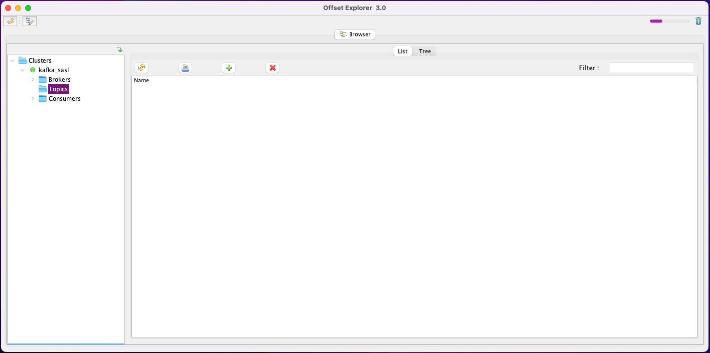
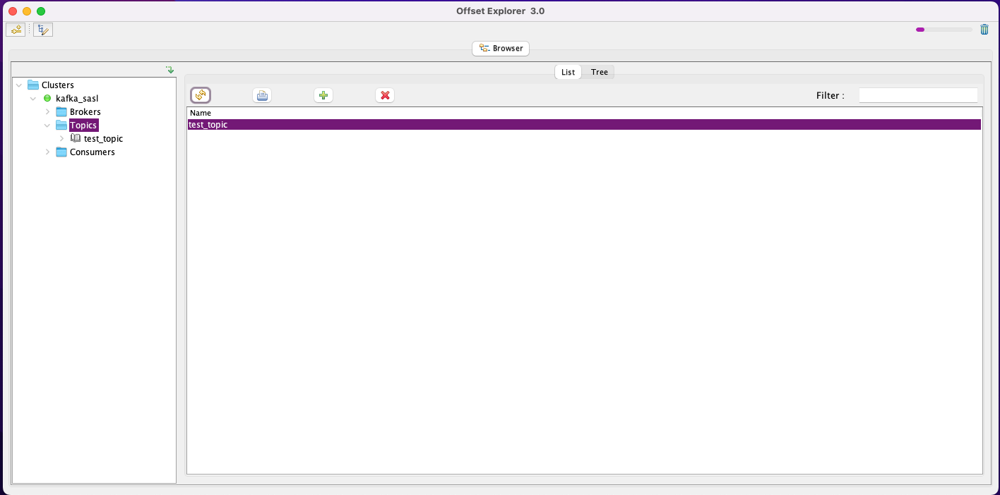
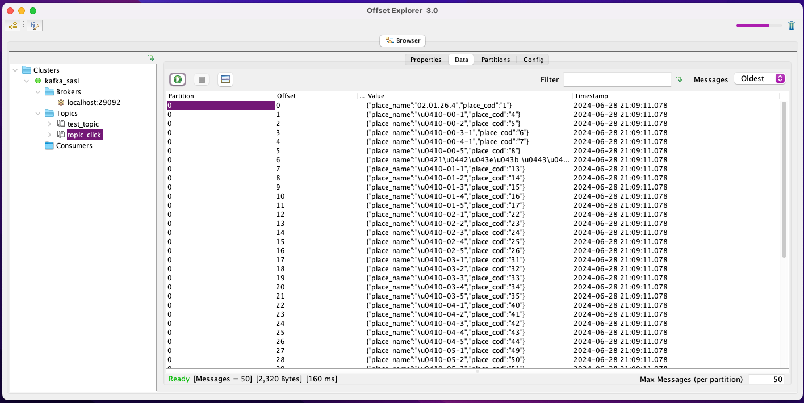
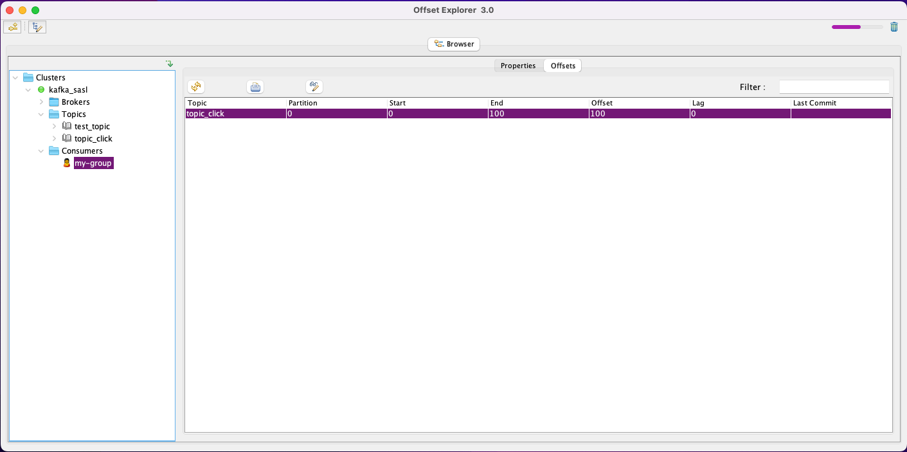

### 1. поднять в docker-compose, из репозитория + sasl
  ```bash
  docker-compose -f docker-compose-kafka-sasl.yml up -d
  ```
  

### 2.   создать топик
   

### 3. python скрипт для заливки данных 
    producer.py

### 4. результат в Offset Explorer
   

### 5. чтение из топика питоном
python скрипт:consumer.py 
```
Received message: {"place_name":"02.01.26.4","place_cod":"1"}
Received message: {"place_name":"\u0410-00-1","place_cod":"4"}
Received message: {"place_name":"\u0410-00-2","place_cod":"5"}
Received message: {"place_name":"\u0410-00-3-1","place_cod":"6"}
Received message: {"place_name":"\u0410-00-4-1","place_cod":"7"}
Received message: {"place_name":"\u0410-00-5","place_cod":"8"}
...
```
